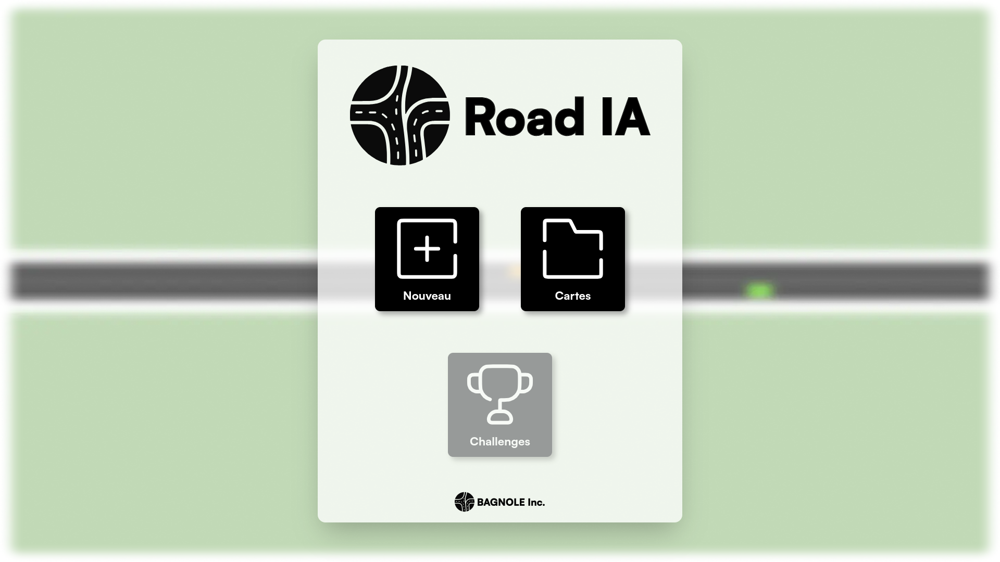
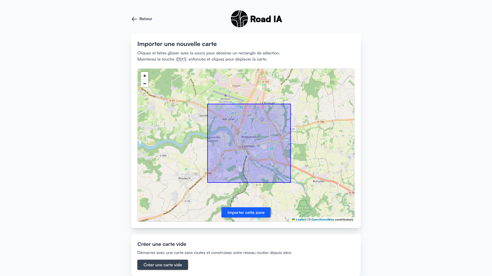
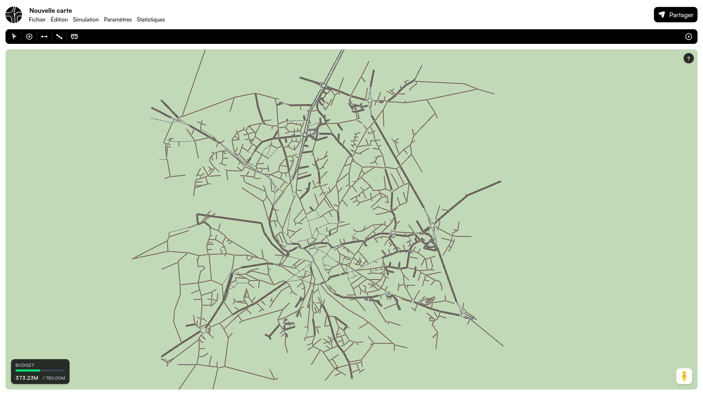
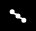
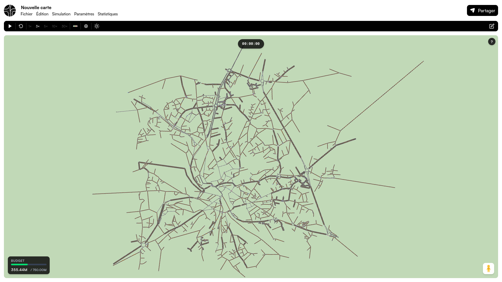
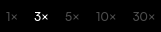
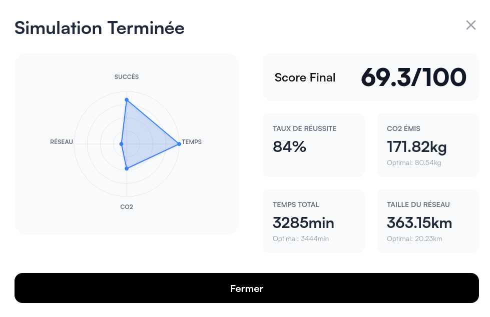

# Documentation utilisateur d’utilisation

## Menu principal

Pour créer une nouvelle carte, cliquez sur `Nouveau`.

Pour ouvrir une carte existante, cliquez sur `Cartes`.

## Nouvelle carte

Pour créer une nouvelle carte vierge, cliquez sur `Créer une carte vide`.

Pour importer une carte depuis [OpenStreetMap](https://www.openstreetmap.org), séléctionner la zone à importer et cliquez sur `Importer cette zone`.

## Édition

Pour passer en mode édition, cliquez sur `Édition`.

Il y a plusieurs outils d'éditions disponibles en haut de l'écran :

-  l'outil de sélection permet de séléctionner une route ou intersection et de modifier ses paramètres
-  cette outil permet d'ajouter une intersection
-  cette outil permet d'ajouter une route
-  permet d'ajouter un point de passage au trajet d'une voiture
-  permet d'ajouter une ligne de bus

Pour acceder à la légende, cliquez sur .

Pour sauvegarder ou supprimer la carte, cliquez sur `Fichier`.

## Simulation

Pour passer en mode simulation, cliquez sur `Simulation`.

Pour accéder aux paramètres de la simulation, cliquez sur `Paramètres`.

Il y a plusieurs outils de simulations disponibles en haut de l'écran :

-  permet de lancer la simulation
-  permet de réinitialiser la simulation
-  permet de modifier la vitesse d'affichage de la simulation
-  permet d'activer la visualisation du traffic grâce à un code couleur
-  permet de choisir entre le mode jour-nuit et le mode classique

Le mode jour-nuit simule une journée de simulation.
Le mode classique démarre le trajet de toutes les voitures directement après le lancement de la simulation.

### Score
Pour accéder au score de la simulation avant qu'elle ne se finisse, cliquez sur `Statistiques`.

Le score est calculé en fonction de quatre paramètres.
L'importance de chaque paramètre dans le calcul du score peut être changer dans les paramètres.
Le taux de réussite correspond au nombre de voitures étant arrivés à déstination à la fin de la simulation.