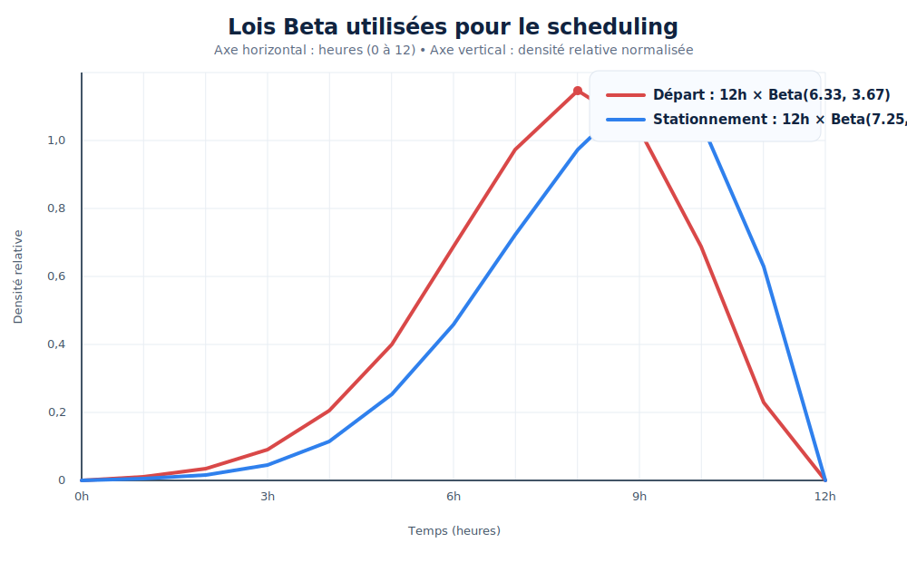

# Scheduling

Cette page décrit la partie scheduling du backend actuel. Le point important est le suivant: **la simulation en croix ne prend pas encore ses paramètres depuis le front**. Tout ce qui concerne le scheduling est aujourd'hui défini dans le backend pour garder un comportement déterministe.

## Ce que représente un profil

Un `ShiftProfileInput` représente un aller-retour logique:

- `origin`: nœud de départ
- `destination`: nœud d'arrivée
- `departure_time`: heure de départ du trajet aller
- `dwell_time`: temps passé sur place avant de repartir

Le code du scheduler manipule ensuite ce profil en deux étapes:

1. il crée le véhicule aller au départ,
2. quand ce véhicule arrive, il crée le véhicule retour avec les mêmes nœuds inversés.

## Deux constructeurs

Le code expose maintenant deux manières de créer un profil.

### 1. `ShiftProfileInput::new(...)`

Ce constructeur sert quand on veut écrire une valeur exacte à la main.
C'est celui qu'on utilise pour le scénario en croix actuel.

Exemple:

```rust
ShiftProfileInput::new(1, 2, 5.0, 5.0)
```

Ici, on dit simplement:

- départ du nœud `1`
- arrivée au nœud `2`
- départ du véhicule à `5.0` secondes
- stationnement de `5.0` secondes avant le retour

### 2. `ShiftProfileInput::random(...)`

Ce constructeur sert à générer automatiquement un profil à partir de deux lois Beta.
Il **n'est pas utilisé par le scénario en croix actuel**, mais il est prêt pour les scénarios futurs.

## Important: les temps sont en secondes

Le moteur de simulation travaille en **secondes**.
Les lois Beta, elles, sont définies sur une fenêtre de **12 heures**.
Le constructeur aléatoire fait donc deux conversions:

- il tire d'abord une valeur Beta entre `0` et `1`,
- puis il la multiplie par `12h = 43_200s`.

Autrement dit:

- `departure_time` est dans `[0, 43_200]` secondes
- `dwell_time` est dans `[0, 43_200]` secondes

## Les deux lois Beta

Les paramètres utilisés sont les suivants:

- temps de départ: `12h * Beta(6.33, 3.67)`
- temps de stationnement: `12h * Beta(7.25, 2.75)`

L'idée est simple:

- la première loi donne des départs plutôt concentrés vers la deuxième moitié de la fenêtre de 12h,
- la seconde donne des temps de stationnement un peu plus tardifs et un peu plus concentrés.

Les courbes ci-dessous sont des **courbes normalisées** pour la lecture visuelle. Elles servent à comprendre la forme des lois, pas à afficher une valeur absolue de densité.



## Ce qui est hardcodé aujourd'hui

Le scénario réellement lancé par `POST /api/simulations` est défini dans `SimulationInstance::new_default()`.
Il utilise la carte en croix et deux profils fixes:

- `1 -> 2` avec un départ à `5.0` secondes et un stationnement de `5.0` secondes
- `3 -> 4` avec un départ à `10.0` secondes et un stationnement de `2.0` secondes

Donc, à ce stade:

- le backend sait générer des profils aléatoires,
- mais le scénario en croix n'utilise pas encore cette génération aléatoire.

## Comment le scheduler s'enchaîne

Le flux réel est le suivant:

1. le backend construit un `ShiftScheduler` avec les profils choisis,
2. il crée les véhicules aller au lancement,
3. le moteur attend que `current_time >= departure_time` pour les faire partir,
4. le scheduler surveille les arrivées,
5. quand un aller arrive, il crée le retour à `arrived_at + dwell_time`,
6. la simulation s'arrête quand tout est terminé ou quand `MAX_DURATION` est atteint.

## Reproduire l'état actuel de la branche

Pour retomber sur exactement ce comportement:

```bash
git switch feature/day-night-cycle
cd server
cargo test --manifest-path Cargo.toml
cd ../client
npm install
npm run build
npm run dev
```

Si tu lances le backend séparément, pense à définir `ALLOWED_ORIGINS` avec l'origine du front, par exemple `http://localhost:3000`.

## Fichiers clés

Si tu veux relire le code derrière ce comportement, les fichiers importants sont:

- `server/src/api/runner/runner.rs`
- `server/src/api/runner/scheduler.rs`
- `server/src/api/runner/map_generator.rs`
- `server/src/simulation/engine.rs`
- `server/src/simulation/vehicle.rs`
- `server/src/simulation/config.rs`
- `server/src/test/engine_tests.rs`
- `server/src/test/simulation_tests.rs`
