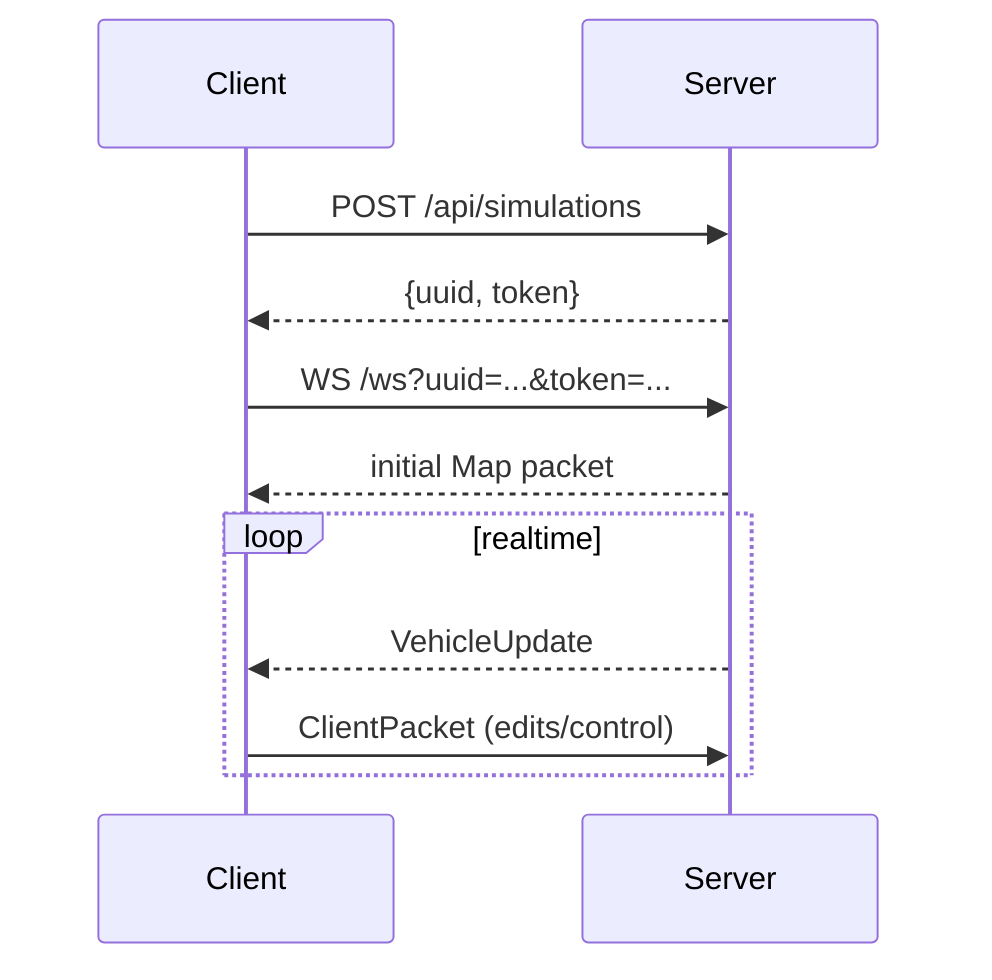

# API Overview

Le backend expose:

- Un endpoint HTTP POST `/api/simulations` pour créer une nouvelle instance de simulation (retourne `uuid` + `token`).
- Un endpoint WebSocket `/ws` pour s'abonner aux mises à jour de la simulation et envoyer des commandes d'édition ou de contrôle.

Les pages suivantes décrivent le protocole WebSocket et le runner qui démarre le serveur.

## Example: create a simulation (HTTP)

Request (cURL):

```bash
curl -X POST http://localhost:8080/api/simulations -H "Content-Type: application/json"
```

Response (JSON):

```json
{ "uuid": "<uuid>", "token": "<token>" }
```

Sequence: create -> connect via WebSocket


