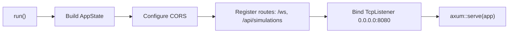
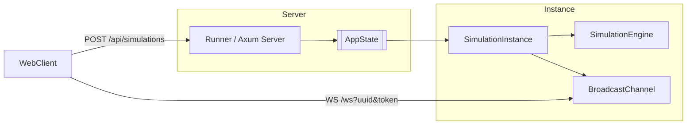

# Runner / Server entrypoints

Fichier principal: `src/api/runner/runner.rs`.

Responsabilités principales:
- Gestion des instances de simulation (`SimulationInstance`) identifiées par `Uuid`.
- Endpoint `/api/simulations` (POST) pour créer une nouvelle instance; renvoie `uuid` et `token`.
- Endpoint `/ws` (WebSocket) pour l'interaction en temps réel.
- Boucle d'exécution des instances: chaque `SimulationInstance` contient un thread asynchrone qui publie périodiquement les `VehicleUpdate` via un `broadcast` channel.

Types importants:
- `SimulationController` : start/stop et état `is_running()`.
- `SimulationInstance` : contient `engine: Arc<Mutex<SimulationEngine>>`, `broadcast`, `controller`, `token`.
- `AppState` : état partagé exposant la map `simulations: HashMap<Uuid, Arc<SimulationInstance>>`.

Configuration CORS et binding réseau sont effectués dans `run()`.

Génération de token: `generate_token()` (utilise `rand`).

Notes opérationnelles:
- `SimulationInstance::new_default()` charge `data/lannion.osm.pbf` via le map generator si disponible.
- L'instance publie périodiquement les mises à jour et envoie un `Score` lorsque la simulation se termine.

## Runner startup sequence

## Example: create + monitor

1. POST `/api/simulations` → server responds `{uuid, token}`
2. Client opens WebSocket `/ws?uuid=<uuid>&token=<token>`
3. Server sends initial `Map` packet and then periodic `VehicleUpdate` packets from the instance's background task

## Notes for operators

- Ensure `ALLOWED_ORIGINS` env var is set before running server.
- The runner uses `tower_http::cors::CorsLayer` to enforce origins and allowed methods.

## Architecture diagram

High-level ownership and component diagram:

