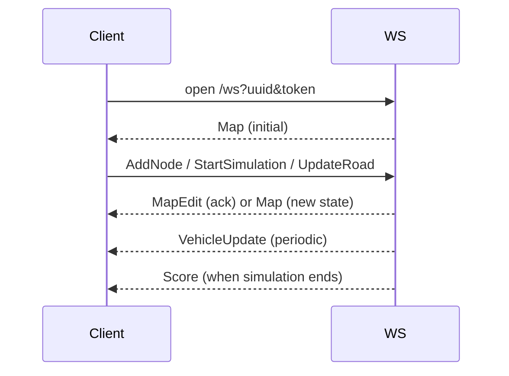

# WebSocket protocol

Résumé du protocole échangé via `/ws` (fichier principal: `src/api/websocket.rs`).

Paramètres de connexion (query):
- `uuid`: identifiant de l'instance de simulation (UUID)
- `token`: jeton d'authentification pour l'instance

Paquets clients (`ClientPacket`):
- `StartSimulation`, `StopSimulation`, `ResetSimulation`
- `AddNode { x, y, kind }`, `DeleteNode { id }`, `MoveNode { id, x, y }`, `UpdateNode { id, kind }`
- `AddRoad { from_id, to_id, lane_count, speed_limit }`, `DeleteRoad { id }`, `UpdateRoad { id, speed_limit }`

Paquets serveur (`ServerPacket`):
- `Map { nodes, edges }` — état complet de la carte
- `VehicleUpdate { vehicles, traffic_lights }` — positions et états des véhicules
- `MapEdit { success, error, nodes, edges }` — réponse aux opérations d'édition
- `Score { score, total_trip_time, total_emitted_co2, network_length, total_distance_traveled, success_rate }`

Notes d'implémentation:
- Les messages sont JSON sérialisés via serde/serde_json.
- Les modifications de carte sont refusées si la simulation est en cours.
- La fonction `serialize_map` et `serialize_vehicle` contrôlent le format côté serveur.

## Example JSON formats

Client -> Server example (start simulation):

```json
{ "id": "StartSimulation", "data": {} }
```

Client -> Server example (add node):

```json
{ "id": "AddNode", "data": { "x": 123.4, "y": 56.7, "kind": "Intersection" } }
```

Server -> Client example (map):

```json
{ "id": "Map", "data": { "nodes": [...], "edges": [...] } }
```

## Payloads — champs détaillés

- ClientPacket fields:
- StartSimulation / StopSimulation / ResetSimulation: empty `data` object, no fields.
- AddNode: `data = { "x": <float>, "y": <float>, "kind": "Habitation|Intersection|Workplace" }` — `x,y` in world coordinates, `kind` is node classification.
- DeleteNode: `data = { "id": <u32> }` — node id assigned by server.
- MoveNode: `data = { "id": <u32>, "x": <float>, "y": <float> }` — new coordinates.
- UpdateNode: `data = { "id": <u32>, "kind": "..." }` — change node kind.
- AddRoad: `data = { "from_id": <u32>, "to_id": <u32>, "lane_count": <u8>, "speed_limit": <float> }` — creates a directed road.
- DeleteRoad: `data = { "id": <u32> }` — road id.
- UpdateRoad: `data = { "id": <u32>, "speed_limit": <float> }` — modify speed limit.

ServerPacket fields:
- Map: `data = { "nodes": [ { "id": <u32>, "x": <float>, "y": <float>, "kind": "..." } ], "edges": [ { "id": <u32>, "from": <u32>, "to": <u32>, "lane_count": <u8>, "speed_limit": <float> } ] }` — nodes and edges are arrays of simple records representing the snapshot.
 - Map: `data = { "nodes": [ { "id": <u32>, "x": <float>, "y": <float>, "kind": "...", "has_traffic_light": <bool>, "radius": <float> } ], "edges": [ { "id": <u32>, "from": <u32>, "to": <u32>, "lane_count": <u8>, "lane_width": <float>, "length": <float>, "speed_limit": <float> } ] }` — nodes and edges are arrays of JSON objects produced by `serialize_map` (includes `has_traffic_light`, `radius`, `lane_width`, `length`).
 - VehicleUpdate: `data = { "vehicles": [ { "id": <u64>, "x": <float>, "y": <float>, "heading": <float>, "kind": "Car|Bus", "state": "Waiting|Moving|Arrived" } ], "traffic_lights": [ { "id": <u32>, "green_road_ids": [<u32>] } ] }` — vehicles are serialized by `serialize_vehicle` (current implementation returns `id`, `x`,`y`,`heading`,`kind`,`state`).
- MapEdit: `data = { "success": <bool>, "error": <string|null>, "nodes": [...], "edges": [...] }` — includes resulting snapshot on success.
- Score: `data = { "score": <float>, "total_trip_time": <float>, "total_emitted_co2": <float>, "network_length": <float>, "total_distance_traveled": <float>, "success_rate": <float> }`

## Server-side functions & parameters (summary)
- `ws_handler(ws: WebSocketUpgrade, Query(params): Query<ConnectParams>, State(state): State<Arc<AppState>>)`: `params.uuid` and `params.token` authenticate and route the socket to the correct `SimulationInstance`.
- `ws_loop(socket, instance, state, uuid)`: `socket` is the upgraded WebSocket, `instance` holds engine/broadcast/controller; loop polls socket messages and the instance's broadcast channel.
- `handle_client_packet(packet, socket, instance)`: `packet` is a `ClientPacket` enum; modifies `instance.engine` under lock for map edits or calls `instance.controller.start/stop`.
- `serialize_map(map) -> (nodes, edges)`: transforms `Map` into two JSON arrays suitable for `ServerPacket::Map`.
- `serialize_vehicle(vehicle, sim_map) -> Value`: serializes a vehicle into `serde_json::Value` with coordinates, heading, speed and state.

## ClientPacket — description champ par champ + exemples JSON

- StartSimulation
	- data: {} (aucun champ)
	- usage: démarre l'exécution de la simulation pour l'instance liée au socket.
	- exemple:

```json
{ "id": "StartSimulation", "data": {} }
```

- StopSimulation
	- data: {} (aucun champ)
	- usage: stoppe l'exécution (met `controller.stop()`).
	- exemple:

```json
{ "id": "StopSimulation", "data": {} }
```

- ResetSimulation
	- data: {} (aucun champ)
	- usage: remet l'état de l'engine à t=0, réinitialise véhicules et chemins.
	- exemple:

```json
{ "id": "ResetSimulation", "data": {} }
```

- AddNode
	- champs:
		- `x` (float) : position X monde.
		- `y` (float) : position Y monde.
		- `kind` (string) : une des `Habitation`, `Intersection`, `Workplace`.
	- validation: `x,y` numériques, `kind` reconnu.
	- exemple:

```json
{ "id": "AddNode", "data": { "x": 123.4, "y": 56.7, "kind": "Intersection" } }
```

- DeleteNode
	- champs:
		- `id` (u32) : identifiant du noeud à supprimer (tel que renvoyé par le serveur).
	- exemple:

```json
{ "id": "DeleteNode", "data": { "id": 42 } }
```

- MoveNode
	- champs:
		- `id` (u32), `x` (float), `y` (float) — nouvelle position.
	- exemple:

```json
{ "id": "MoveNode", "data": { "id": 42, "x": 130.0, "y": 60.2 } }
```

- UpdateNode
	- champs:
		- `id` (u32), `kind` (string) — nouveau type.
	- exemple:

```json
{ "id": "UpdateNode", "data": { "id": 42, "kind": "Workplace" } }
```

- AddRoad
	- champs:
		- `from_id` (u32), `to_id` (u32) : ids de noeuds existants.
		- `lane_count` (u8) : nombre de voies (>=1).
		- `speed_limit` (float) : en unités de projet.
	- exemple:

```json
{ "id": "AddRoad", "data": { "from_id": 10, "to_id": 11, "lane_count": 2, "speed_limit": 13.9 } }
```

- DeleteRoad
	- champs: `id` (u32) — identifiant de la route.
	- exemple:

```json
{ "id": "DeleteRoad", "data": { "id": 17 } }
```

- UpdateRoad
	- champs: `id` (u32), `speed_limit` (float) — met à jour la limite de vitesse.
	- exemple:

```json
{ "id": "UpdateRoad", "data": { "id": 17, "speed_limit": 11.1 } }
```

## ServerPacket — description champ par champ + exemples JSON

- Map
	- data:
		- `nodes`: tableau d'objets `{ id: u32, x: float, y: float, kind: string }`.
		- `edges`: tableau d'objets `{ id: u32, from: u32, to: u32, lane_count: u8, speed_limit: float }`.
	- usage: snapshot complet de la carte; envoyé à la connexion lors de l'upgrade et après opérations d'édition.
	- exemple (simplifié):

```json
{
	"id": "Map",
	"data": {
		"nodes": [ { "id": 1, "x": 0.0, "y": 0.0, "kind": "Habitation" } ],
		"edges": [ { "id": 2, "from": 1, "to": 3, "lane_count": 2, "speed_limit": 13.9 } ]
	}
}
```

- VehicleUpdate
	-	- data:
	-		- `vehicles`: tableau d'objets véhicule (produit par `serialize_vehicle`) comprenant actuellement:
	-			- `id` (u64)
	-			- `x`, `y` (float) : coordonnées monde
	-			- `heading` (float) : orientation en radians
	-			- `kind` (string) : `Car` | `Bus`
	-			- `state` (string) : `Waiting` | `Moving` | `Arrived`
	-			- champs additionnels (non exposés par la version actuelle) : `position_on_lane`, `velocity`, `path_index` — peuvent être ajoutés si besoin.
	-		- `traffic_lights`: tableau `{ id: u32, green_road_ids: [<u32>] }` indiquant routes (road ids) actuellement ouvertes par les controllers.

	### Schémas JSON exhaustifs

	Nodes (produit par `serialize_map`):

	```json
	{
		"id": 1,
		"kind": "Intersection",
		"x": 10.0,
		"y": 5.0,
		"has_traffic_light": false,
		"radius": 4.0
	}
	```

	Edges / Roads:

	```json
	{
		"id": 2,
		"from": 1,
		"to": 3,
		"lane_count": 2,
		"lane_width": 3.0,
		"length": 120.0,
		"speed_limit": 13.9
	}
	```

	Full `Map` payload example (combining nodes + edges):

	```json
	{
		"id": "Map",
		"data": {
			"nodes": [ /* Node objects as above */ ],
			"edges": [ /* Edge objects as above */ ]
		}
	}
	```

	Vehicle (exact shape from `serialize_vehicle`):

	```json
	{
		"id": 1001,
		"x": 12.3,
		"y": 45.6,
		"heading": 1.5708,
		"kind": "Car",
		"state": "Moving"
	}
	```

	Traffic lights (as serialized):

	```json
	{
		"id": 5,
		"green_road_ids": [ 2, 3 ]
	}
	```

	MapEdit (success):

	```json
	{
		"id": "MapEdit",
		"data": {
			"success": true,
			"error": null,
			"nodes": [ /* full nodes snapshot */ ],
			"edges": [ /* full edges snapshot */ ]
		}
	}
	```

	MapEdit (failure):

	```json
	{
		"id": "MapEdit",
		"data": { "success": false, "error": "Stop simulation before editing the map", "nodes": [], "edges": [] }
	}
	```
		- `traffic_lights`: tableau `{ id: u32, green_road_ids: [<u32>] }` indiquant routes (road ids) actuellement ouvertes par les controllers.
	- exemple (simplifié):

```json
{
	"id": "VehicleUpdate",
	"data": {
		"vehicles": [ { "id": 1001, "x": 12.3, "y": 45.6, "vx": 5.0, "vy": 0.0, "state": "OnRoad" } ],
		"traffic_lights": [ { "controller_id": 5, "green_links": [101,102] } ]
	}
}
```

- MapEdit
	- data:
		- `success` (bool)
		- `error` (string|null)
		- `nodes`, `edges` : snapshot résultant si `success=true`.
	- exemple (success):

```json
{
	"id": "MapEdit",
	"data": { "success": true, "error": null, "nodes": [...], "edges": [...] }
}
```

	- exemple (failure):

```json
{
	"id": "MapEdit",
	"data": { "success": false, "error": "Stop simulation before editing", "nodes": [], "edges": [] }
}
```

- Score
	- data: champs numériques décrivant métriques finales.
	- exemple:

```json
{
	"id": "Score",
	"data": { "score": 87.5, "total_trip_time": 1234.0, "total_emitted_co2": 56.7, "network_length": 1200.0, "total_distance_traveled": 10000.0, "success_rate": 0.95 }
}
```

## HTTP endpoint `/api/simulations` (POST) — champs et exemple

- Request: aucun body requis.
- Response (JSON): `{ "uuid": "<uuid>", "token": "<hex32>" }` — `uuid` identifie l'instance, `token` autorise la connexion WS.

Exemple:

Request:

```http
POST /api/simulations HTTP/1.1
Host: localhost:8080
Content-Type: application/json

{}
```

Response:

```json
{ "uuid": "550e8400-e29b-41d4-a716-446655440000", "token": "a1b2c3..." }
```

## Authentification/handshake WS
- Connexion WebSocket: client ouvre `/ws?uuid=<uuid>&token=<token>`.
- Le serveur valide `uuid` & `token` puis renvoie `Map` initial.

---

J'ai ajouté ces descriptions champ-par-champ et exemples JSON. Veux-tu que je fasse la même chose pour les fonctions publiques de `runner` et les utilitaires `map_generator` (POST `/api/simulations` already covered) ?

## Runtime sequence (WebSocket)


