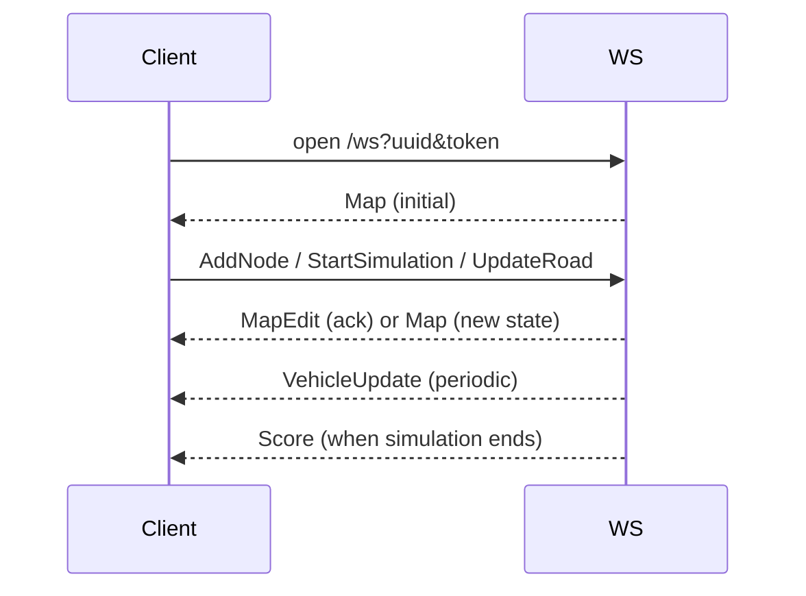

# WebSocket protocol

Fichier principal: `src/api/websocket.rs`.
Ce chapitre décrit le protocole JSON échangé sur `/ws`, les structures de données sérialisées par le serveur et la logique interne qui relie le socket à une `SimulationInstance`.

## Connexion
### `ConnectParams`

Paramètres de requête attendus lors de l'ouverture du WebSocket.

- `uuid` : identifiant de la simulation à rejoindre.
- `token` : jeton d'authentification associé à cette simulation.
Si l'un des deux est invalide, la connexion est immédiatement rejetée avec une fermeture `Unauthorized`.

## Paquets clients
### `ClientPacket`

Le client envoie une seule étiquette JSON `id` et un objet `data`. Les variantes actuelles sont les suivantes:
| Variante | Rôle |
|---|---|
| `StartSimulation` | Démarre l'exécution du moteur. |
| `StopSimulation` | Arrête l'exécution du moteur. |
| `ResetSimulation` | Réinitialise l'état courant de la simulation. |
| `AddNode` | Ajoute un noeud de carte (`x`, `y`, `kind`). |
| `DeleteNode` | Supprime un noeud (`id`). |
| `UpdateNode` | Change le type d'un noeud (`id`, `kind`). |
| `AddRoad` | Ajoute une route orientée (`from_id`, `to_id`, `lane_count`, `speed_limit`). |
| `DeleteRoad` | Supprime une route (`id`). |
| `UpdateRoad` | Modifie la limite de vitesse (`id`, `speed_limit`), et éventuellement le nombre de voies (`lane_count`). |
| `SetSpeed` | Modifie la vitesse d'exécution du worker (`multiplier`). |
| `RequestScore` | Demande un score complet. |
| `RequestDensity` | Demande une carte de densité par route. |
| `AddWaypoints` | Ajoute des points de passage à un véhicule (`vehicle_id`, `node_ids`). |
| `RequestVehicles` | Demande la liste détaillée des véhicules. |
| `CreateBusLine` | Crée une ligne de bus (`name`, `stop_node_ids`). |
| `DeleteBusLine` | Supprime une ligne de bus (`bus_line_id`). |
| `RequestBusLines` | Demande la liste des lignes de bus. |

Le message `UpdateRoad` accepte aussi un `lane_count` optionnel dans la version actuelle du serveur.
## Paquets serveur

### `ServerPacket`

| Variante | Rôle |
| `Map` | Instantané complet de la carte. |
| `VehicleUpdate` | État temps réel des véhicules et des feux. |
| `MapEdit` | Réponse à une opération d'édition de carte. |
| `Score` | Résultat complet de la simulation. |
| `SimulationFinished` | Notification de fin de simulation. |
| `DensityMap` | Résultat de la requête de densité par route. |
| `VehicleList` | Liste détaillée des véhicules. |
| `BusLineList` | Liste des lignes de bus. |

## Fonctions de contrôle du socket

### ws_handler
Valide l'accès et initialise la connexion WebSocket.
- **Entrées** : `ws: WebSocketUpgrade`, `params: ConnectParams`, `state: Arc<AppState>`.
- **Action** : Vérifie la validité du `uuid` de simulation et du `token`. Si valide, passe le socket à `ws_loop`.
- **Retour** : `Response`.

### ws_loop
Gère la communication bidirectionnelle continue.
- **Entrées** : `socket: WebSocket`, `instance: Arc<SimulationInstance>`, `state: Arc<AppState>`, `uuid: Uuid`.
- **Action** :
    1. Envoie l'état initial de la carte au client.
    2. Gère en parallèle les messages entrants du client (via `handle_client_packet`) et les messages sortants du worker (broadcast).
    3. Gère la déconnexion et le nettoyage de l'instance si plus aucun client n'est connecté.

### process_incoming_msg
Traite un message brut reçu depuis le socket.
- **Action** : Décode le JSON en `ClientPacket` et appelle `handle_client_packet`.
- **Retour** : `bool` (continuer la boucle).

### process_broadcast_msg
Relaye un message interne du serveur vers le client.
- **Action** : Sérialise le `ServerPacket` et l'envoie sur le socket.
- **Retour** : `bool`.

### handle_client_packet
Point d'entrée de la logique métier du WebSocket.
- **Entrées** : `packet: ClientPacket`, `socket`, `instance`.
- **Action** : Distribue l'action vers les fonctions appropriées (moteur ou éditeur) en vérifiant les droits (ex: interdiction d'éditer si la simulation tourne).

### send_edit_error
Envoie un paquet `MapEdit` signalant un échec au client.

### broadcast_map_edit_success
Diffuse un paquet `MapEdit` signalant un succès à tous les clients connectés.

### serialize_map
Transforme la structure `Map` en données JSON pour le frontend.
- **Entrées** : `map: &Map`.
- **Action** : Parcourt le graphe pour extraire les positions des nœuds, leurs types, et les caractéristiques des routes (voies, longueur, vitesse).
- **Retour** : `(Vec<Value>, Vec<Value>)` (Liste des nœuds, Liste des arêtes).
### `serialize_vehicle`

Produit la représentation détaillée d'un véhicule pour le flux temps réel. Le format inclut l'identifiant, la position, l'orientation, le type logique, l'état, la motorisation, l'origine, la destination et les waypoints.

### `serialize_vehicle_summary`
Produit une version condensée d'un véhicule, utilisée pour les listes et les réponses plus légères.

### `serialize_bus_line`
Produit la sérialisation d'une ligne de bus avec son identifiant, son nom, ses arrêts et le véhicule associé.

### `serialize_intersection_kind`
Convertit une chaîne reçue du client en `IntersectionKind`. Cette fonction centralise la validation des chaînes comme `Habitation`, `Intersection` et `Workplace`.

### `serialize_traffic_lights`
Construit la vue JSON des contrôleurs de feux actifs. Pour chaque contrôleur, le serveur liste les routes actuellement vertes sous forme de `green_road_ids`.

## Formes de données importantes
### Carte

Le paquet `Map` contient deux tableaux:

- `nodes` : noeuds du graphe avec position, métadonnées et liste des `internal_lanes` (trajectoires d'intersection);
- `edges` : routes avec longueur, vitesse, nombre de voies et largeur de voie.
### Véhicule

Le paquet `VehicleUpdate` contient:

- `vehicles` : positions et états de tous les véhicules;
- `traffic_lights` : ensemble des feux et de leurs routes ouvertes.
### Score

Le paquet `Score` expose les mesures finales:
- `score` : Valeur finale sur 100.
- `total_trip_time` / `ref_total_trip_time` : Temps cumulé réel vs théorique.
- `total_emitted_co2` / `ref_total_emitted_co2` : CO2 cumulé réel vs théorique.
- `network_length` / `ref_network_length` : Longueur d'infrastructure réelle vs borne inférieure de Steiner.
- `success_rate` : Ratio de véhicules arrivés à destination.

## Ce qu'il faut retenir
- Le WebSocket est le canal de temps réel de la simulation.
- L'édition de carte est bloquée tant que la simulation tourne.
- Le serveur distingue toujours entre les réponses légères (`VehicleList`, `BusLineList`) et les instantanés complets (`Map`, `MapEdit`).
## Exemples JSON

### Client -> Serveur (Démarrer simulation)
```json
{ "id": "StartSimulation", "data": {} }
```

### Client -> Serveur (Ajouter noeud)
```json
{ "id": "AddNode", "data": { "x": 123.4, "y": 56.7, "kind": "Intersection" } }
```

### Serveur -> Client (Mise à jour véhicules)
```json
{
	"id": "VehicleUpdate",
	"data": {
		"vehicles": [ { "id": 1001, "x": 12.3, "y": 45.6, "heading": 1.57, "kind": "Car", "state": "Moving" } ],
		"traffic_lights": [ { "id": 5, "green_road_ids": [2, 3] } ]
	}
}
```

## Runtime sequence (WebSocket)


```mermaid
sequenceDiagram
	participant Client
	participant WS
	Client->>WS: open /ws?uuid&token
	WS-->>Client: Map (initial)
	Client->>WS: AddNode / StartSimulation / UpdateRoad
	WS-->>Client: MapEdit (ack) or Map (new state)
	WS-->>Client: VehicleUpdate (periodic)
	WS-->>Client: Score (when simulation ends)
```
