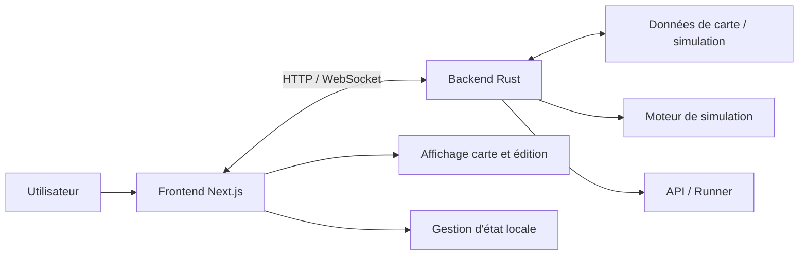

# Architecture du projet RoadIA

Ce document présente la structure globale du projet RoadIA, les responsabilités de chaque composant et les flux de données principaux.

## 1. Présentation générale

RoadIA est une application web de conception et de simulation de réseau routier en temps réel. Le projet permet de créer une carte, de gérer des infrastructures et d'observer le trafic via un moteur de simulation côté serveur.

L'application est organisée en deux blocs principaux :
- **Frontend** : Next.js et TypeScript (interface utilisateur et édition).
- **Backend** : Rust avec Axum et Tokio (métier, simulation et temps réel).

## 2. Vue d'ensemble de l'architecture

Le frontend sert de point d'entrée. Il communique avec le backend via HTTP pour les actions classiques et WebSocket pour les mises à jour de simulation en temps réel.

## 3. Structure du dépôt

| Répertoire | Rôle |
|---|---|
| `client/` | Interface web, rendu graphique (Pixi.js/Leaflet), interaction utilisateur. |
| `server/` | API, simulation, persistance, gestion des WebSockets. |
| `docker-compose.yml` | Orchestration locale des services. |
| `architecture/` | Documentation technique détaillée. |

## 4. Frontend

Le frontend repose sur **Next.js 16**, **React 19** et **TypeScript**.

### Responsabilités
- Gestion des cartes (création, chargement, suppression).
- Rendu cartographique et édition interactive.
- Communication temps réel via WebSocket pour l'affichage de la simulation.

### Points d'entrée notables
- `client/app/page.tsx` : Accueil et gestion des cartes.
- `client/app/map/[uuid]/page.tsx` : Édition et simulation.

## 5. Backend

Le backend est écrit en **Rust**, utilisant **Axum** pour le réseau et **Tokio** pour l'asynchronisme.

### Responsabilités
- Persistance des données (cartes et exports).
- Orchestration de la simulation de trafic.
- Gestion des flux WebSocket.

### Organisation fonctionnelle
- `server/src/api/` : Couche d'exposition réseau.
- `server/src/map/` : Modèle du réseau routier.
- `server/src/simulation/` : Moteur de calcul des déplacements.
- `server/src/scoring/` : Indicateurs de performance.

## 6. Flux de fonctionnement

### Simulation en temps réel
1. Le serveur exécute la boucle de simulation (`step`).
2. Les positions et événements sont calculés.
3. Les données sont diffusées via **WebSocket**.
4. Le frontend met à jour le rendu graphique.

## 7. Persistance

Les données sont stockées localement dans `server/data/`. Le backend garantit la cohérence des fichiers tandis que le frontend manipule les métadonnées.
