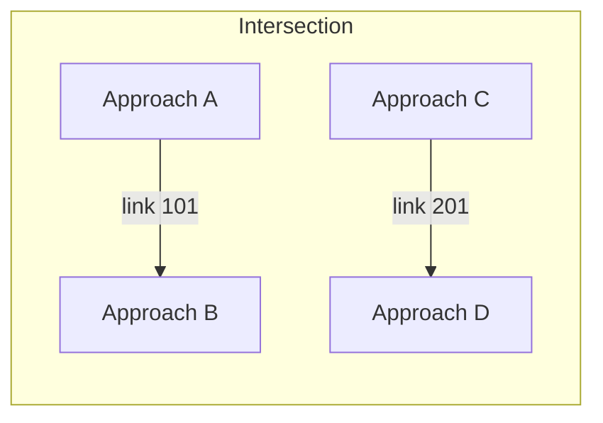

# Intersections

Fichier: `src/map/intersection.rs`.

Concepts principaux:
- `Intersection` contient `internal_lanes` (type `InternalLane`) définissant les mouvements à l'intérieur d'un carrefour.
- `build_intersections(map)` construit les `InternalLane` et `Link` pour chaque noeud du graphe: calcule entrées/sorties, crée `link_id` et identifie les `foe_links` (conflits entre mouvements).
- Fonctions utilitaires: `segments_intersect`, `boundary_point`, `lane_boundary_point`, `is_link_open`, `time_window_conflict`, etc.

Règles de priorité et ouverture de lien:
- `LinkType` influence le comportement (`Priority`, `Yield`, `Stop`, `TrafficLight`).
- `is_link_open` prend en compte le type de lien, l'état des feux (`green_links`), véhicules présents et conflit temporel d'approche.

Ces algorithmes sont centraux pour la logique d'intersection du simulateur.

## Worked example: two conflicting movements

Imaginons une intersection simple avec deux mouvements en conflit: `A→B` (link id 101) et `C→D` (link id 201). Leur `DrivePlanEntry` fournit des fenêtres d'arrivée/départ estimées.

Supposons:

- Ego (`link_id=101`): `arrival_time = 12.0` s, `leave_time = 12.8` s
- Foe (`link_id=201`): `arrival_time = 12.3` s, `leave_time = 13.0` s

La fonction `time_window_conflict([12.0,12.8], [12.3,13.0])` renvoie `true` (fenêtres se chevauchent). Si `foe` a priorité, `is_link_open` retournera `false` pour l'ego.

### Mermaid diagram: conflict schematic

## Worked example: priority & traffic lights

1. Si `link.link_type == TrafficLight` et `green_links` contient `link.id`, `is_link_open` autorise le passage (si les voies internes ne sont pas occupées).
2. Si `link.link_type == Stop`, l'ego doit rester arrêté jusqu'à l'absence de conflit temporel avec ses `foe_links`.
3. Si `link.link_type == Yield`, on vérifie `foe_is_to_the_right` pour appliquer priorité à droite lorsque pertinent.

## Debugging tips

- Inspecter la table `link_states: HashMap<u32, LinkState>` pour afficher les `ApproachData` actuels.
- Visualiser `intersection.internal_lanes` et `link.foe_links` pour comprendre les blocages.
