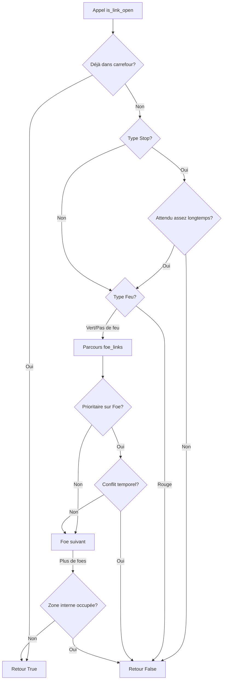

# Intersections

Fichier: `src/map/intersection.rs`.

Les intersections transforment deux routes abstraites en une géométrie de traversée, puis en règles de priorité et de conflit exploitables par le moteur.

## Types de base

### `IntersectionKind`

Type fonctionnel du noeud.

- `Habitation` : zone d'origine potentielle pour les véhicules.
- `Intersection` : carrefour standard.
- `Workplace` : zone de destination potentielle.

### `Intersection`

Noeud du graphe routier.

| Champ | Rôle |
|---|---|
| `id` | Identifiant public du noeud. |
| `kind` | Rôle fonctionnel du noeud. |
| `center_coordinates` | Position du carrefour. |
| `radius` | Rayon utilisé pour la géométrie d'entrée/sortie. |
| `internal_lanes` | Trajectoires internes construites par `build_intersections`. |

### `InternalLane`

Trajectoire à l'intérieur du carrefour.

| Champ | Rôle |
|---|---|
| `id` | Identifiant interne. |
| `from_lane_id` | Voie d'entrée. |
| `to_lane_id` | Voie de sortie. |
| `length` | Longueur géométrique du passage. |
| `speed_limit` | Limite de vitesse pour ce passage. |
| `entry` | Point d'entrée géométrique. |
| `exit` | Point de sortie géométrique. |

### `ApproachData`

Fenêtre temporelle réservée par un véhicule sur un lien.

| Champ | Rôle |
|---|---|
| `arrival_time` | Heure prévue d'entrée. |
| `leave_time` | Heure prévue de sortie. |
| `arrival_speed` | Vitesse à l'entrée. |
| `leave_speed` | Vitesse à la sortie. |
| `will_pass` | Indique si le véhicule devrait effectivement franchir le carrefour. |

### `LinkState`

État dynamique associé à un lien, surtout pour savoir quels véhicules l'ont réservé.

- `approaching` : table `vehicle_id -> ApproachData`.

## Construction des mouvements

### `build_intersections(map)`

Recalcule toute la topologie d'intersection à partir du graphe actuel.

- **Entrée** : `map: &mut Map`.
- **Action** : 
    1. Réinitialise les identifiants de liens globaux de la carte.
    2. Pour chaque intersection, vide les trajectoires internes (`internal_lanes`).
    3. Pour chaque route, vide la liste des liens sortants des voies.
    4. Appelle `build_intersection` pour chaque nœud du graphe.
- **Post-conditions** : La carte est prête pour la simulation avec des intersections configurées géométriquement et logiquement.

### `build_intersection(map, junction)`

Construit les mouvements et détecte les conflits pour un carrefour unique.

- **Entrées** :
    - `map: &mut Map`.
    - `junction: NodeIndex`.
- **Action** :
    1. Identifie toutes les routes entrantes et sortantes.
    2. Génère toutes les paires possibles (route_entrante, route_sortante) si elles ne font pas demi-tour (U-turn).
    3. **RawLink** : Utilise une structure interne temporaire pour stocker les caractéristiques de chaque liaison candidate :
        - Arêtes source et destination.
        - Indices de voies.
        - Coordonnées de l'entrée et de la sortie sur le bord du carrefour.
    4. Crée les `InternalLane` et les `Link` (liens logiques).
    5. Analyse les intersections géométriques entre les trajectoires pour peupler les listes de conflits (`foe_links`).
    6. Assigne les priorités (Stop, Yield, Priority) selon la configuration ou les types de routes.

## Aides géométriques

### node_coords
Récupère les coordonnées d'un nœud.
- **Retour** : `(f32, f32)`.

### boundary_point
Calcule un point à la périphérie de l'intersection (en fonction de son rayon) dans la direction d'un voisin.
- **Entrées** : centre (jx, jy), rayon, point cible (px, py).
- **Retour** : `(f32, f32)`.

### segments_intersect
Détermine si deux segments de droite `(p1, p2)` et `(p3, p4)` se croisent physiquement. Utilisé pour la détection de conflits de trajectoires.
- **Retour** : `bool`.

### lane_boundary_point
Décale un point de bordure perpendiculairement à la direction de la route pour aligner une voie spécifique.
- **Entrées** : point de base, vecteur perpendiculaire, index de la voie, largeur de voie.
- **Retour** : `(f32, f32)`.

### dist
Calcule la distance Euclidienne entre deux points.
- **Retour** : `f32`.

### cross
Calcule le produit vectoriel de deux vecteurs (OA et OB). Utilisé pour tester l'orientation de points.
- **Retour** : `f32`.

### on_segment
Vérifie si un point `q` se trouve sur le segment `pr`.
- **Retour** : `bool`.

### lerp
Interpolation linéaire entre deux valeurs `a` et `b`.
- **Entrées** : `a`, `b`, `t` (facteur entre 0 et 1).
- **Retour** : `f32`.

### perp_right
Calcule le vecteur perpendiculaire à droite d'un vecteur directionnel donné.
- **Entrées** : `dx`, `dy`.
- **Retour** : `(f32, f32)`.

## Arbitrage et priorité

### foe_is_to_the_right
Détermine si un lien adverse se trouve à la droite du lien courant (priorité à droite).
- **Retour** : `bool`.

### time_window_conflict
Vérifie si deux fenêtres d'occupation d'une intersection se chevauchent.
- **Entrées** : heures d'arrivée et de sortie des deux véhicules, vitesses, impatience.
- **Action** : Compare les intervalles temporels en tenant compte des marges de sécurité.
- **Retour** : `bool`.

### is_link_open
Vérifie si un véhicule peut s'engager sur un lien à un instant donné.

- **Entrées** : `link`, `vehicle`, `ego_data`, `link_states`, `vehicles_by_lane`, `vehicles`, `junction_id`, `look_ahead`, `stop_dwell_time`, `green_links`.
- **Action** :
    - Vérifie si le lien est contrôlé par un feu et si celui-ci est vert.
    - Applique l'arrêt obligatoire (dwell time) pour les panneaux Stop.
    - Pour chaque lien adverse en conflit (`foe_link`) :
        - Vérifie si un véhicule plus prioritaire a déjà réservé une fenêtre temporelle conflictuelle.
        - Applique la règle de priorité à droite si les deux véhicules ont la même priorité de base.
    - Vérifie si la zone de conflit interne est déjà occupée physiquement.
    - Gère l'impatience : un véhicule bloqué trop longtemps réduit ses marges de sécurité perçues.
- **Retour** : `bool`.

```mermaid
graph TD
    Start[Appel is_link_open] --> Internal{Déjà dans carrefour?}
    Internal -- Oui --> Open[Retour True]
    Internal -- Non --> Stop{Type Stop?}
    Stop -- Oui --> Dwell{Attendu assez longtemps?}
    Dwell -- Non --> Closed[Retour False]
    Dwell -- Oui --> TL{Type Feu?}
    Stop -- Non --> TL
    TL -- Rouge --> Closed
    TL -- Vert/Pas de feu --> Foes[Parcours foe_links]
    Foes --> MustYield{Prioritaire sur Foe?}
    MustYield -- Non --> NextFoe[Foe suivant]
    MustYield -- Oui --> Conflict{Conflit temporel?}
    Conflict -- Oui --> Closed
    Conflict -- Non --> NextFoe
    NextFoe -- Plus de foes --> Occupied{Zone interne occupée?}
    Occupied -- Oui --> Closed
    Occupied -- Non --> Open
```

## Ce qu'il faut retenir

- `build_intersections` est appelée après toute modification de la topologie.
- Les conflits sont résolus à partir de la géométrie et des fenêtres temporelles.
- `ApproachData` et `LinkState` sont les objets centraux de l'arbitrage.
