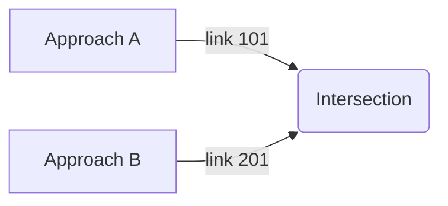

# Intersection scenarios (deadlock, priority-right, traffic-light)

This page describes small scenarios you can construct to validate engine behavior.

Scenario 1 — Priority-right deadlock (2-vehicle deadlock)
- Setup: two approaches A and B arriving simultaneously, both are `Yield` to each other (e.g. misconfigured foe links), both wait for the other → deadlock.
- Expected behavior: engine should detect no progress; remedies include adding small jitter to arrival times or an impatience escalation that forces one vehicle to proceed after timeout.

Mermaid diagram (schematic):

Scenario 2 — Priority-right example
- Setup: Ego on approach A, Foe on approach B. Foe arrives earlier or is to the right (depending on geometry). If `foe_is_to_the_right` returns true, Ego should yield.
- Test: tune arrival windows to make tie-breaker rely on `foe_is_to_the_right`.

Scenario 3 — Traffic-light timing
- Setup: traffic light with two phases: phase 1 opens links [101,102] for 10s, phase 2 opens [201] for 8s.
- Observations: `advance_traffic_lights` should populate `green_links` with ids of currently green links; `is_link_open` should allow `TrafficLight` type links only when their id is in `green_links`.

How to run scenarios (suggestion)
1. Construct a small `Map` programmatically via `editor::add_node` / `add_road` or by starting from an example map.
2. Call `build_intersections(&mut map)`.
3. Create `Vehicle` instances with `trip` origins/destinations designed to traverse the target links and set `departure_time` to control arrival ordering.
4. Run `SimulationEngine::new(config, vehicles)` and step through `engine.step()` while logging `DrivePlanEntry` and `link_states`.
