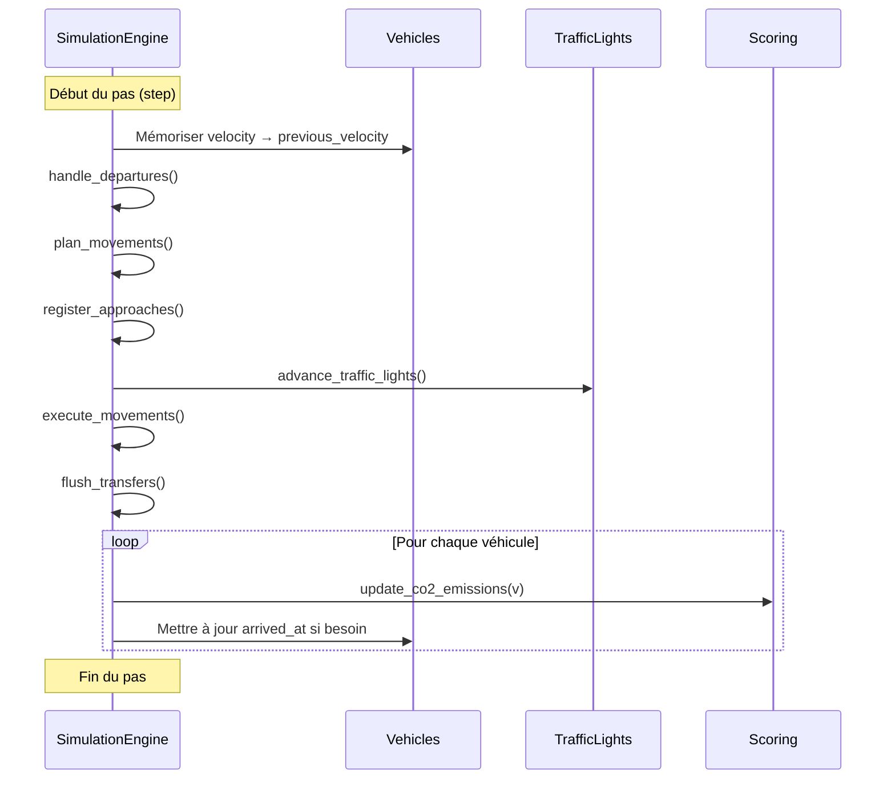

# Engine details

Fichier: `src/simulation/engine.rs`.

Le moteur est le cœur de la simulation. Il maintient les véhicules, fait avancer le temps, arbitre les conflits d'intersection, gère les feux tricolores et agrège les données nécessaires au score final.

## Le trait `Simulation`

Le trait formalise l'interface minimale d'un moteur de simulation:

- `new(config, vehicles)` construit une instance prête à tourner.
- `run()` exécute la simulation complète jusqu'à la fin.
- `step()` avance d'un pas de temps.
- `get_score()` calcule le score final.

## Structures internes

### `PendingTransfer`

Représente un déplacement temporaire d'un véhicule entre deux voies. Cette structure sert à différer certaines mutations du graphe de véhicules jusqu'à la fin du pas de temps, afin d'éviter les conflits d'emprunts et de conserver une exécution déterministe.

### `TrafficLightRuntimeState`

Stocke l'état courant d'un feu tricolore pendant l'exécution:

- `phase_index` : phase active actuelle.
- `time_in_phase` : temps déjà passé dans cette phase.

### `BusLine`

Représente une ligne de bus active dans la simulation.

- `id` : identifiant de la ligne.
- `name` : nom lisible de la ligne.
- `stop_node_ids` : liste des arrêts.
- `vehicle_id` : identifiant du bus associé à la ligne.

### `SimulationEngine`

Structure principale du moteur.

| Champ | Rôle |
|---|---|
| `config` | Configuration globale de la simulation. |
| `vehicles` | Liste complète des véhicules. |
| `current_time` | Temps simulé courant. |
| `vehicles_by_lane` | Index des véhicules par voie, triés du plus proche au plus loin. |
| `link_states` | Réservations temporelles par lien d'intersection. |
| `all_vehicles_arrived` | Indique si tous les véhicules ont terminé. |
| `green_links` | Identifiants des liens actuellement ouverts par les feux. |
| `bus_lines` | Lignes de bus actives. |
| `next_bus_line_id` | Compteur de génération des lignes de bus. |
| `next_vehicle_id` | Compteur de génération des véhicules supplémentaires. |
| `pending_transfers` | Transferts différés à appliquer en fin de pas. |
| `traffic_light_states` | État runtime de chaque contrôleur de feux. |
| `link_directory` | Index global des `Link` du graphe pour accès rapide. |

## Cycle de simulation

### `SimulationEngine::new`

Crée un moteur à partir d'une configuration et d'une liste de véhicules. L'instance initialise les états de feux à partir de la carte, construit un index de tous les liens du réseau, et démarre le temps simulé à `start_time`.

### `SimulationEngine::run`

Prépare d'abord tous les chemins des véhicules, puis appelle `step()` jusqu'à atteindre `end_time`.

### `SimulationEngine::step`

Un pas de simulation suit toujours le même ordre:

1. mémoriser la vitesse précédente de chaque véhicule,
2. gérer les départs,
3. préparer les mouvements,
4. enregistrer les approches,
5. faire avancer les feux,
6. exécuter les déplacements,
7. appliquer les transferts différés,
8. mettre à jour les émissions et les dates d'arrivée.

## Méthodes de cycle détaillées

### handle_departures
Gère le passage des véhicules de l'état `WaitingToDepart` à `OnRoad`.
- **Entrée** : `&mut self`.
- **Action** : Vérifie pour chaque véhicule en attente si son heure de départ est arrivée et si la première voie de son trajet est libre. Si oui, insère le véhicule sur la voie.

### plan_movements
Phase de décision pour tous les véhicules actifs.
- **Action** : Parcourt les véhicules sur les routes normales et recalcule leur `drive_plan` s'ils s'approchent d'une intersection.

### rebuild_drive_plan
Calcule les réservations pour les prochaines intersections du trajet d'un véhicule.
- **Entrées** : `vidx: usize`.
- **Action** : Simule le mouvement futur du véhicule sur plusieurs segments pour estimer les heures d'arrivée aux carrefours et choisir les voies internes optimales.

### register_approaches
Enregistre officiellement les intentions de passage dans les carrefours.
- **Action** : Pour chaque véhicule ayant un plan de conduite, ajoute son `ApproachData` à l'état du lien correspondant (`link_states`) si le passage est autorisé.

### advance_traffic_lights
Fait évoluer le temps interne des contrôleurs de feux.
- **Entrée** : `&mut self`.
- **Action** : Incrémente le compteur de chaque feu. Si la durée d'une phase est dépassée, passe à la suivante et met à jour les liens ouverts (`green_links`).

### execute_vehicle
Applique la physique du mouvement à un véhicule.
- **Entrées** : `vidx: usize`, `lane_id: LaneId`.
- **Action** : 
    1. Détermine la vitesse de sécurité selon le véhicule de devant et l'état des liens.
    2. Calcule l'accélération (IDM).
    3. Met à jour la position et la vitesse.
    4. Gère les transitions entre les routes et les intersections (via `process_lane_advances`).

### determine_safe_speed
Calcule la vitesse maximale autorisée pour un véhicule en tenant compte des obstacles.
- **Entrées** : `vidx: usize`.
- **Action** : Analyse la distance jusqu'au prochain véhicule sur la même voie et l'état de l'intersection à venir (Stop, feu rouge, ou conflit).
- **Retour** : `(v_cible, distance_obstacle)`.

### find_link
Cherche un lien d'intersection par son ID.
- **Retour** : `Option<Link>`.

### vehicle_ahead_info
Identifie le véhicule précédant immédiatement un autre sur une voie donnée.
- **Retour** : `(distance, vitesse)`.

### process_lane_advances
Gère le passage d'un véhicule d'une section à la suivante (ex: sortie de route vers intersection).
- **Action** : Détecte si le véhicule a dépassé la longueur de sa voie actuelle et déclenche les fonctions de transition appropriées.

### exit_internal_lane
Gère la sortie d'un carrefour pour entrer sur une nouvelle route.
- **Action** : Met à jour la position du véhicule et prépare un transfert vers la voie de destination.

### enter_junction_or_arrive
Gère l'entrée dans un carrefour ou l'arrivée à destination.
- **Action** : Si le véhicule a atteint son dernier nœud, il passe à l'état `Arrived`. Sinon, il s'engage sur la voie interne réservée.

### flush_transfers
Applique tous les changements de voies mis en attente pendant le pas de temps.
- **Action** : Met à jour `vehicles_by_lane` et les champs `current_lane` des véhicules concernés.

### lane_insert_sorted
Helper pour insérer un véhicule dans l'index d'une voie tout en maintenant le tri par position.

### add_bus_from_saved
Ajoute un bus à la simulation à partir d'une ligne sauvegardée.
- **Entrée** : `bl: &SavedBusLine`.
- **Action** : Crée un véhicule de type `Bus`, initialise son trajet passant par tous les arrêts de la ligne, et l'ajoute à la liste des véhicules actifs.
- **Retour** : `bool` (succès).

## Ce qui vaut d'être retenu

- Le moteur ne se contente pas de déplacer les véhicules: il réserve aussi les intersections à l'avance.
- Les feux, la priorité et les conflits temporels sont évalués conjointement.
- La séparation entre planification et exécution évite de mélanger les décisions de sécurité avec le déplacement physique.
