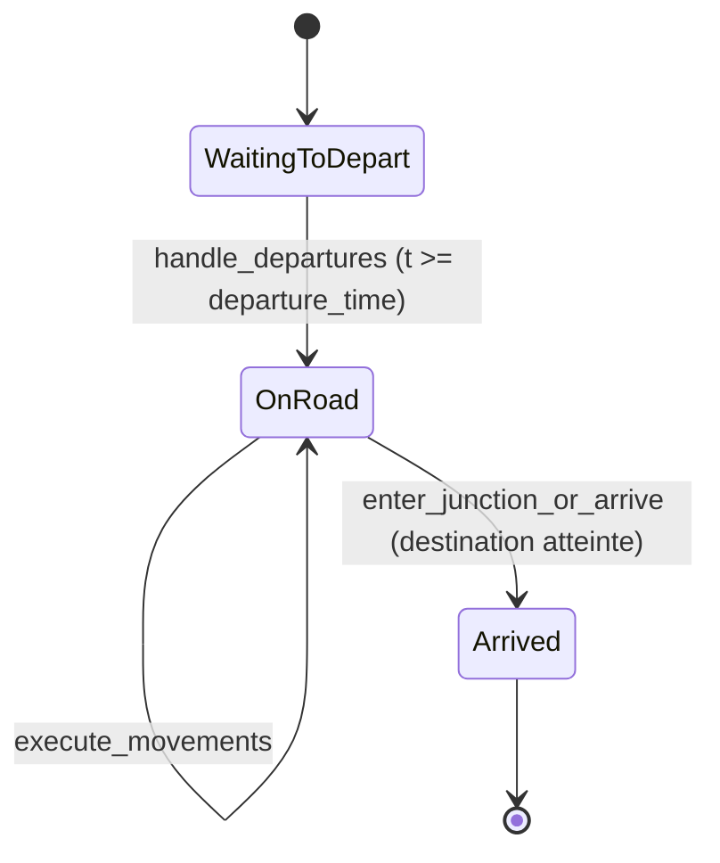

# Modèle de Véhicule

Le module `vehicle` définit les structures et les comportements des véhicules au sein de la simulation, incluant leur dynamique, leur planification de trajet et leur état.

## Énumérations

### VehicleType
Définit le type de motorisation du véhicule. Utilisé principalement pour le calcul des émissions de CO2 et du score environnemental.

- **Variantes** : `Hybride`, `Electrique`, `Essence`, `Diesel`.

### VehicleKind
Définit la catégorie du véhicule.

- **Variantes** : 
    - `Car` : Voiture particulière standard.
    - `Bus` : Transport en commun (plus long, vitesse et accélération différentes).

### LaneId
Identifiant unique d'une voie sur laquelle se trouve un véhicule.

- **Variantes** :
    - `Normal(EdgeIndex, u32)` : Voie standard sur une route (Index de l'arête, Index de la voie).
    - `Internal(u32, u32)` : Voie interne à une intersection (ID de l'intersection, ID de la voie interne).

### VehicleState
Représente l'état actuel du véhicule dans le cycle de simulation.

- **Variantes** :
    - `WaitingToDepart` : Le véhicule attend son heure de départ prévue.
    - `OnRoad` : Le véhicule est activement en train de circuler sur la carte.
    - `Arrived` : Le véhicule a atteint sa destination finale.

## Structures

### VehicleSpec
Spécifications physiques et performances d'un type de véhicule.

- **Champs** :
    - `kind` : `VehicleKind`.
    - `max_speed` : Vitesse maximale autorisée (m/s).
    - `max_acceleration` : Accélération maximale (m/s²).
    - `comfortable_deceleration` : Décélération confortable pour le conducteur (m/s²).
    - `reaction_time` : Temps de réaction du conducteur (s).
    - `length` : Longueur du véhicule (m).

### TripRequest
Requête de trajet définissant le point de départ et d'arrivée.

- **Champs** :
    - `origin` : Nœud de départ (`NodeIndex`).
    - `destination` : Nœud d'arrivée (`NodeIndex`).
    - `departure_time` : Heure de départ prévue (s).

### DrivePlanEntry
Entrée dans le plan de conduite calculé par le moteur de simulation pour gérer les réservations de liens.

- **Champs** : Contient les informations de réservation de lien (`link_id`), l'heure d'arrivée prévue (`arrival_time`), la vitesse de passage (`v_pass`), etc.

### Vehicle
Structure principale représentant un véhicule actif.

- **Champs principaux** :
    - `id` : Identifiant unique.
    - `spec` : Spécifications physiques.
    - `state` : État actuel.
    - `motorization` : Type de moteur (`VehicleType`).
    - `waypoints` : Liste de points de passage intermédiaires.
    - `path` : Liste complète des nœuds du trajet calculé.
    - `position_on_lane` : Distance parcourue sur la voie actuelle (m).
    - `velocity` : Vitesse actuelle (m/s).
    - `previous_velocity` : Vitesse au pas précédent (pour le calcul de l'accélération).
    - `current_lane` : Voie occupée (`Option<LaneId>`).
    - `waiting_time` : Temps passé à l'arrêt devant une intersection.
    - `impatience` : Score d'impatience croissant quand le véhicule est bloqué.
    - `emitted_co2` : Cumul du CO2 émis.
    - `distance_traveled` : Distance totale parcourue.
    - `arrived_at` : Instant précis de l'arrivée (`Option<f32>`).
    - `lane_change_cooldown` : Temps restant avant de pouvoir changer de voie à nouveau (s).
    - `desired_velocity` : Vitesse que le véhicule tente d'atteindre, influencée par la limite de vitesse et le comportement du conducteur (m/s).
    - `commute_plan_id` : Identifiant du plan pendulaire associé (`Option<u64>`).
    - `path_index` : Index du nœud actuel dans le trajet `path`.

## Fonctions globales

### fastest_path
Calcule le chemin le plus rapide entre deux points en utilisant l'algorithme A*.

- **Entrées** :
    - `map: &Map` : Référence à la carte.
    - `source: NodeIndex` : Point de départ.
    - `destination: NodeIndex` : Point d'arrivée.
- **Action** : Utilise la longueur des routes divisée par la vitesse limite comme poids pour les arêtes.
- **Retour** : `Option<Vec<NodeIndex>>` (liste ordonnée des nœuds du chemin).

## Méthodes de Vehicle

### new
Crée une nouvelle instance de véhicule.

- **Entrées** : `id`, `spec`, `trip`, `motorization`.
- **Retour** : Une instance de `Vehicle` initialisée à l'état `WaitingToDepart`.

### update_path
Calcule ou met à jour le chemin complet du véhicule (incluant les points de passage forcés).

- **Entrées** : `map: &Map`.
- **Action** : Remplit le champ `self.path` en concaténant les segments de chemin les plus rapides. Gère les **points de passage (Waypoints)** obligatoires pour les bus afin de respecter les arrêts prévus.

### compute_acceleration
Calcule l'accélération à appliquer selon le modèle IDM (Intelligent Driver Model).

- **Entrées** :
    - `desired_velocity` : Vitesse souhaitée.
    - `minimum_gap` : Distance de sécurité minimale.
    - `vehicle_ahead_distance` : Distance avec le véhicule de devant.
    - `vehicle_ahead_velocity` : Vitesse du véhicule de devant.
- **Action** : 
    - Le véhicule calcule sa vitesse désirée en fonction de `spec.max_speed` et de la limite de vitesse de la route.
    - L'accélération est calculée pour équilibrer l'envie d'atteindre `desired_velocity` et le besoin de maintenir une distance de sécurité par rapport au leader.
- **Retour** : `f32` (accélération en m/s²).

### get_coordinates
Calcule les coordonnées (x, y) réelles du véhicule sur la carte.

- **Entrées** : `map: &Map`.
- **Action** : Interpole la position entre les nœuds de la voie actuelle, en tenant compte des décalages latéraux (lanes) et des trajectoires dans les intersections.
- **Retour** : `Coordinates`.

### get_heading
Calcule l'orientation (angle) du véhicule en radians.

- **Entrées** : `map: &Map`.
- **Retour** : `f32` (angle entre -PI et PI).

### get_current_node / get_next_node
Accesseurs pour les nœuds actuels et suivants du trajet.

### get_current_road
Récupère l'arête du graphe correspondant à la route actuelle.

- **Retour** : `Option<EdgeIndex>` (None si le véhicule est dans une intersection).
